# 实验报告

## 数据类型

### 1. int.m

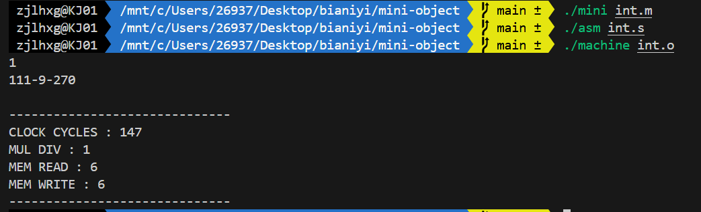

### 2. char.m

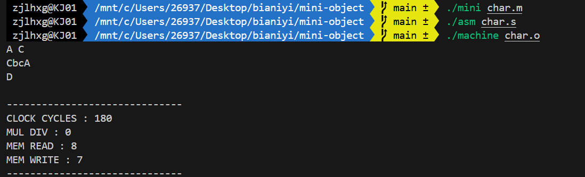

### 3. char-int.m

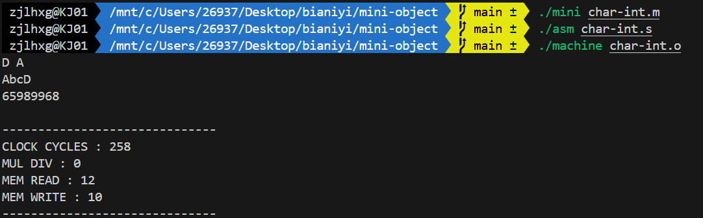

### 4. ptr-int.m

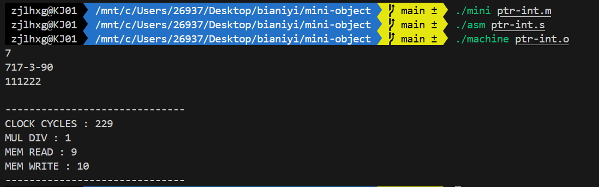

### 5. ptr-char.m

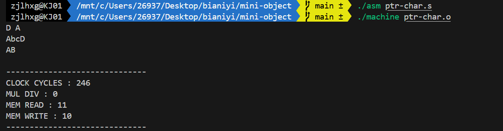

### 6. ptr-char-int.m

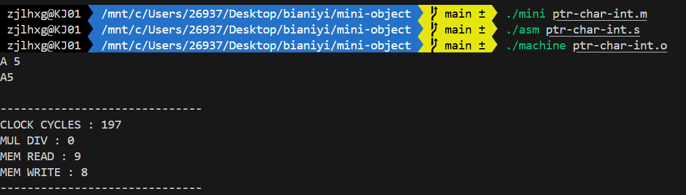

### 7. arr.m

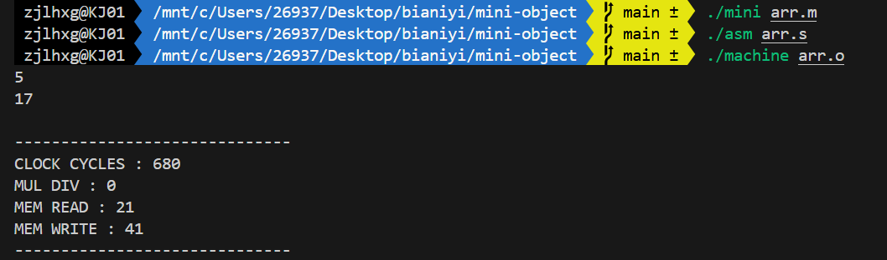

### 8. arr-while.m

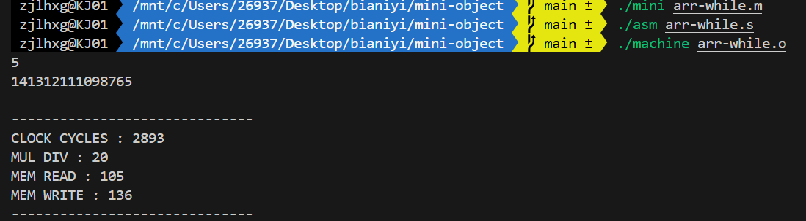

### 9. arr-struct.m

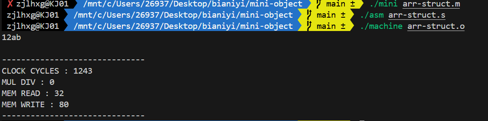

### 10. struct.m

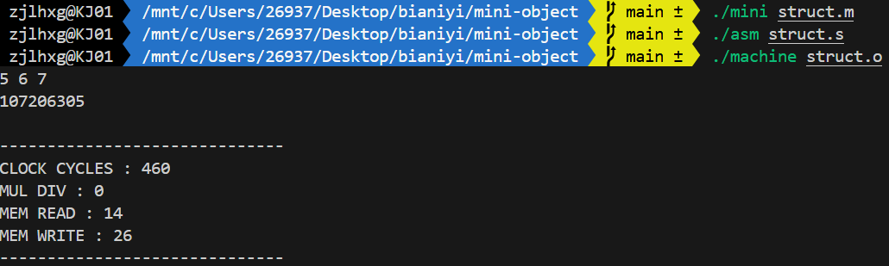

### 11. struct-arr.m

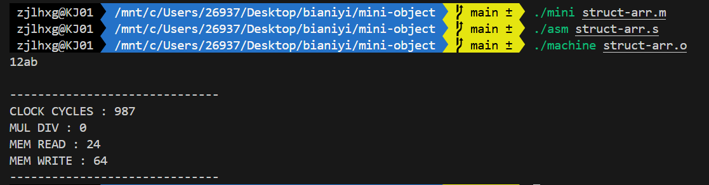

### 12. struct-ptr.m

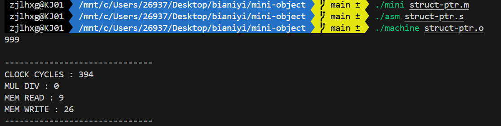

## 控制结构

### 13. if.m

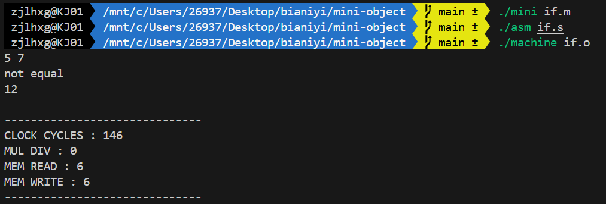

### 14. switch.m

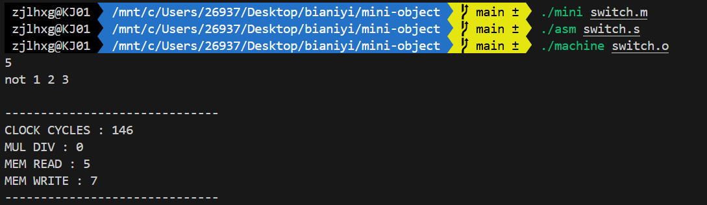

### 15. while.m

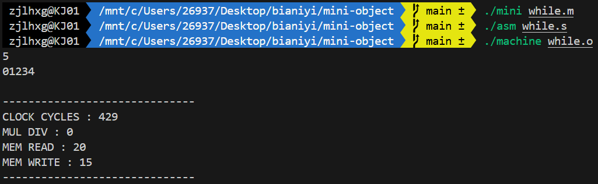

### 16. while-bc.m

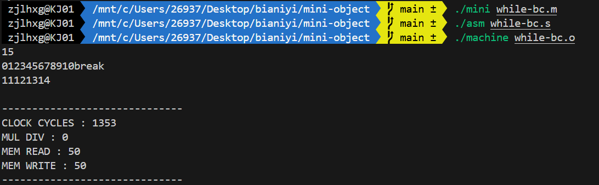

### 17. for.m

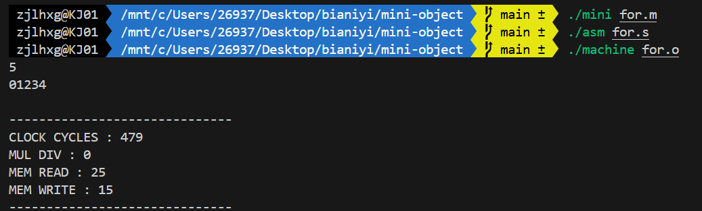

### 18. for-bc.m

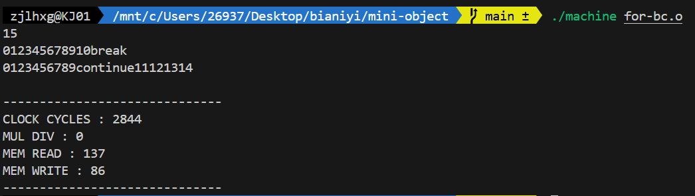

## 函数

### 19. func-int.m

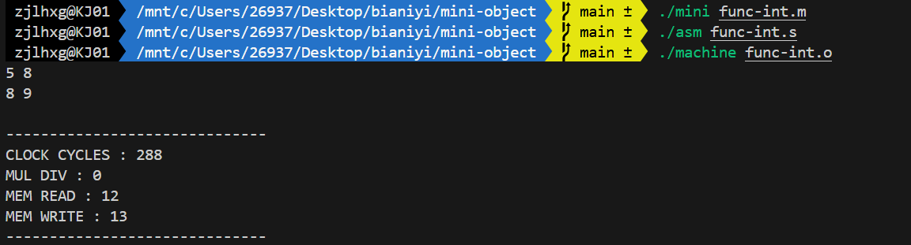

### 20. func-char.m

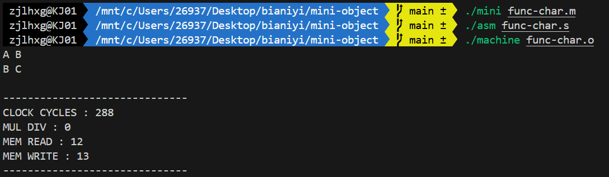

## 效率测试

### loop.m

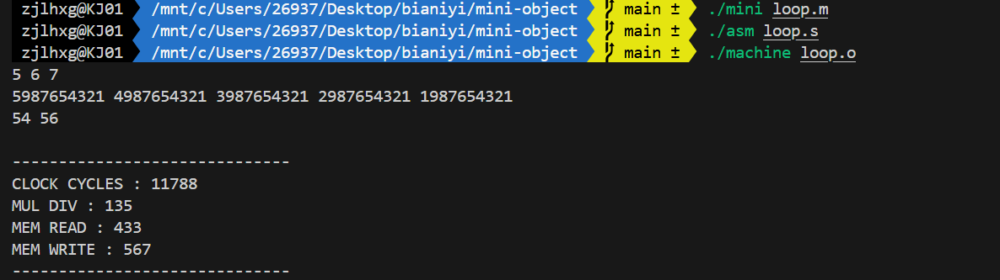